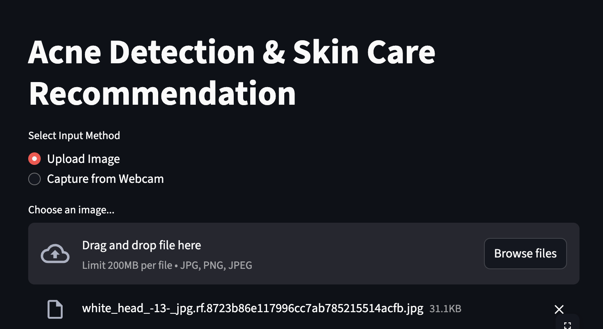
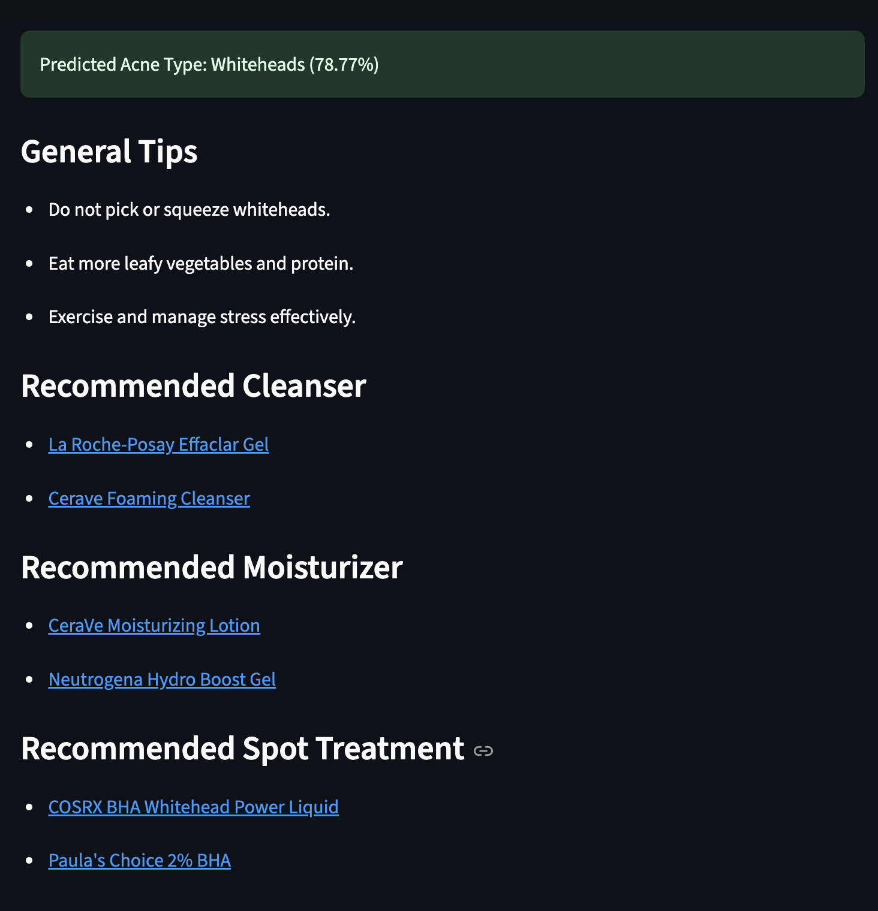

# Acne Detection & Skin Care Recommendation

This is a Streamlit-based web application that detects acne severity from images and provides personalized skin care recommendations. Users can either **upload an image** or **capture a photo via webcam**. The app predicts the acne type and offers advice, product suggestions, diet tips, and lifestyle recommendations.

---

## Features

- **Acne Detection**: Detects five types of acne:
  - Blackheads
  - Cyst
  - Papules
  - Pustules
  - Whiteheads
- **Face Detection**: Automatically detects the face using MTCNN and crops the acne region for prediction.
- **Skin Care Recommendations**: Provides general advice, recommended cleansers, moisturizers, spot treatments, diet tips, and lifestyle tips.
- **Input Options**: Supports both image upload and webcam capture.
- **Prediction Accuracy**: The model achieves **79% accuracy** on the test dataset.

---

## Installation

1. Clone this repository:

    - git clone https://github.com/Madhumitha-Somasundaram/Acne_skin_care_recommendation.git
    - cd Acne_skin_care_recommendation
2. Create a virtual environment:

    - python -m venv .venv
    - source .venv/bin/activate
3. Install dependencies:

    - pip install -r requirements.txt
4. Place the trained model file acne_classifier.h5 in the project folder.

## Usage
1.Run the Streamlit app:
    - streamlit run app.py

2. Open the app in your browser (usually opens automatically at http://localhost:8501).

3. Select an input method:
    - Upload an image

    - Capture from webcam
   

4. Click Predict to view:

    - Predicted acne type

    - Confidence percentage

    - General advice with diet & lifestyle tips

    - Recommended skin care products (cleanser, moisturizer, spot treatment)
   
